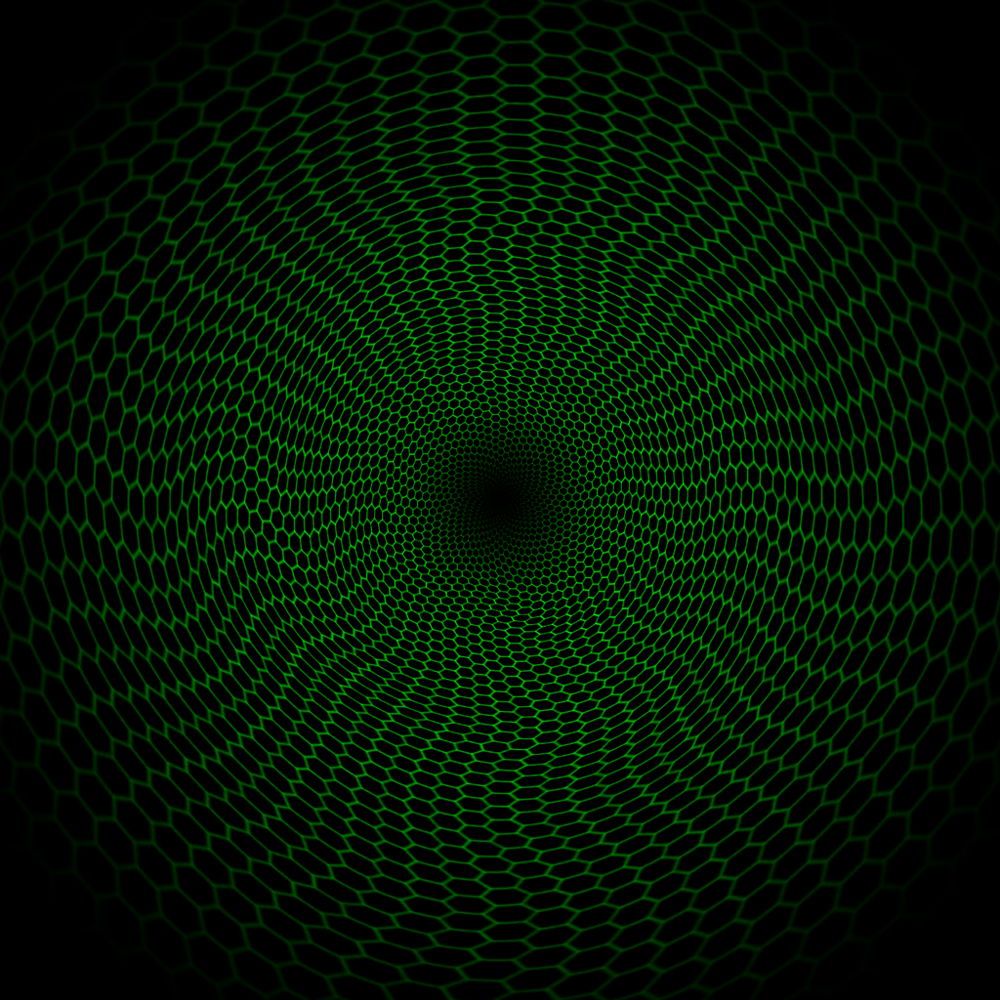

# Web-typografie

**Zoë Kostopoulos - Minor Visual Interface Design - Web-typografie - VID2**

## De opdracht

Voor het vak web-typografie moesten wij een eigen closed-captions ontwerpen. Closed Captions zijn ondertitelingen in series, films of televisie die slecht-horende / dove mensen helpen bij het begrijpen van eventuele belangrijke geluiden. Zo kun je denken aan het geluid dat iemand van achteren wordt beslopen, dit kan worden 'vertaald' door dit neer te zetten in de Closed Captions. 

Closed Captions worden altijd weergegeven in vorm van ondertiteling. De opdracht voor dit vak was om dit spannender te maken voor de slechthorende / dove mensen. Doormiddel van CSS en eventuele animaties kun je namelijk de Closed Captions ondersteunen en duidelijker maken hoe geluid wordt gebruikt in televisie. 

Voor deze opdracht moesten wij een deel van de film Bladerunner 2049 verbeteren. In deze 2 scene's wordt de hoofdpersoon Constant K. ondervraagt en moet hij bepaalde zinnen en woorden herhalen om de test te voldoen. In de eerste scene doet hij dit uitstekend maar in de tweede scene faalt hij. 

[De scene's uit Bladerunner 2049.](https://www.youtube.com/watch?v=vrP-_T-h9YM)

## Typografische keuze

Je *moet* een van deze twee opties kiezen, en je keuze moet je onderbouwen. In je readme staat een uitleg over je overwegingen om de ene of de andere restrictie te kiezen.

> ### Optie 1: Systeemfont

> De eerste optie is dat je gebruik maakt van het zogenaamde *systeemfont* van degene die naar jouw werk kijkt. Dit font verschilt per operating system, en het verschilt soms zelfs per versie van het operating system. Het is ook aan te passen door de gebruiker zelf. 

> Je hebt dus geen controle over welk lettertype er precies gebruikt wordt. Het levert dus een onzeker, en beperkt typografisch palet op. Je hebt geen *light* versies, of *extrabold*. En ook geen serif en sans-serif versie van dezelfde familie. In dit geval heb je alleen de beschikking over normal, **bold** en _italic_. Dit heeft natuurlijk ook zijn voordelen!

> ### Optie 2: Brenner

>Je kan er ook voor kiezen om gebruik te maken van de complete Brenner familie. Dit is een zeer uitgebreid en uiterst flexibel font. [Hier kan je je verdiepen in dit font](https://www.typotheque.com/blog/brenner_an_unusual_typeface_family_with_distinct_voices). Als je kiest voor dit font dan heb je de beschikking over een *sans serif*, een *condensed*, een *serif*, een *monotype*, een *slab*, een *display* en een *script* versie. En veel van deze versies hebben varianten van *light* tot *bold*, en allemaal zowel *bold* als *italic*.

>Met Brenner zijn er natuurlijk veel en veel meer mogelijkheden dan met systeemfonts. Dat kan zowel een voordeel als een nadeel zijn. 

>Voor een overzicht, zie [de brenner.pdf](brenner.pdf).

Mijn keuze viel direct voor de tweede optie Brenner. Zelf vind ik het erg fijn om met restricties te werken en te weten hoe het eindresultaat eruit ziet bij iemand anders. Dit was namelijk niet het geval geweest voor de eerste optie; het systeemfont. 
Het font Brenner heeft veel mogelijkheden en zo heb ik meer grip op de closed captions. 

De stemmen uit het fragment heb ik in delen opgedeeld: 

- **Machine**:Brenner Mono Medium

*Dit font is wat dikker en robuster. De stem van de machine is een serieuze stem die eentonige vragen stelt. De stem is ook nogal autoritair, daarvan dit font.*

- **Ryan Gosling**: Brenner Sans Light

*Dit font is smal en wat simpeler. Constant K. praat namelijk zachter dan de computer. In combinatie met de achtergrond waren de woorden niet helemaal goed te zien en heb ik hier een zwarte balk achter gemaakt, zodat het beter te lezen is en de essentie van de woorden niet verdwijnt.*

- **Ryan Gosling Reciting**: Brenner Sans Condensed Light

*Dit font wordt in het begin gebruikt, hier citeerd Constant K. zijn 'baseline'. Het is hier niet duidelijk of hij al in de ruimte zit of dit vanuit zijn ruimteschip citeert. Daarom heb ik gekozen voor een soort gelijk font als hier boven, maar net iets anders. Dit font staat iets dichterbij elkaar, maar is evengoed nog erg smal. Dit komt omdat Constant K. niet een heel erg harde stem heeft.*

- **Fuck off - voice**: Brenner Sans Condensed Regular

*Dit font is dikker dan de andere fonts en moet wat abrubter overkomen. Er wordt namelijk gevloekt met dit font. Om duidelijk te maken dat dit van de voorbijlopende man is, heb ik er 'agent' voorgezet, aangezien dit een agent is die voorbij loopt.*

- **We're done - voice**: Brenner Mono Medium

*Naar mijn mening is de 'we're done' voice het zelfde als de computerstem, dus heb ik de zelfde font aangehouden.*

- **Sound Captions**: Brenner Mono Regular

*De sound captions heb ik zo uitgezocht dat ze lijken op sound captions die in televisie worden gebruikt. De sound captions moeten niet te veel opvallen, maar wel genoeg zodat het gelezen wordt. Dit font is daarom normaal en iets wat statisch.*

De ondertiteling staat gewoon onder de video in het midden. Dit is de meest natuurlijke plaats om de ondertiteling te zien. De herhaling van de woorden door Constant K. staan iets onder de woorden van de computer. Dit heb ik gedaan om duidelijk te maken dat het om een andere stem gaat. 

## Gebruik van Closed Captions en feedback

Het was nogal een uitdaging om animaties of sound captions toe te voegen aan het fragment. Na de kennismaking met Marie hoorde ik dat zij erg te spreken was over de closed captions van de serie The Walking Dead. Toevallig kijk ik deze serie ook, dus besloot ik deze verder te kijken met closed captions en zelfs een paar afleveringen zonder ondertiteling. Hierdoor kreeg ik meer inzicht over hoe het is voor iemand als Marie om een serie te kijken. 

Voor het eerste feedbackmoment wilde ik eerst experimenteren met animaties. Ik was benieuwd of dit net zo goed zou werken als sound captions. Hiervoor had ik een paar geluiden vormgegeven in het fragment doormiddel van CSS. Bij het feedbackmoment vertelde Marie mij dat ze dit meer in combinatie met sound captions wilde zien. Zij heeft namelijk helemaal geen besef van de animaties en welke geluiden zij uitbeelden. 

Na deze feedback besloot ik dit toe te voegen en bij het tweede feedback gesprek te laten zien. Marie vondt dit een verbetering en zei dat ik zo door moest gaan. 
Door de gesprekken met Vasilis kreeg ik inspiratie om soort van over de kop te gaan met het uitbeelden van de geluiden en een sfeer te creeëren. 

Ik heb animaties, GIF's en sound captions gebruikt om dit te doen. De sound captions heb ik boven de video neergezet zodat de captions duidelijk verdeeld zijn over de pagina. 
De animaties vertalen twee korte geluiden in het begin van het fragment en worden ondersteund door sound captions. De rest van de video worden ondersteund door GIF's die een duidelijk sfeer maken. De GIF's heb ik zo uitgezocht zodat het bij de sfeer van het fragment past maar ook de geluiden die er hadden moeten zijn. Ze vervangen de geluiden. 

De sound captions heb ik op basis van de termen die ik voorbij zag komen tijdens het kijken van The Walking Dead en andere series. Het gebruiken van herkenbare termen maakt het makkelijker om er iets bij voor te stellen. 

## Visuele vormgeving

De video is breder gemaakt zodat het meer een 'bioscoop' gevoel geeft en de GIF's zijn uitgekozen op sfeer van de geluiden. Het geeft een extra effect en maakt het visueel heel spannend. 

### De GIF's

Sterrenhemel: 

Dit geeft het begin een sereen gevoel van in de ruimte zijn.

Tunnel van groene leds:

Deze 'trippy' tunnel geeft op een 1 en gek beeld wanneer het beeld inzoomt op Constant K., dit was precies wat ik zocht en voelde bij het geluid. 

 
Blauwe tunnel:

Deze GIF past goed bij de sfeer en blauwe kleuren die worden gebruikt in het laaste deel van het fragment.

## Aftermath

Ik vond deze opdracht super leuk om te maken en meer te leren over Closed Captions. Hierdoor sta je stil hoe vanzelfsprekende dingen anders kunnen worden ervaren door mensen en hoe je dit kan toepassen in je designs. Het werken met CSS was opzich een uitdaging maar wel erg leuk om te doen. De wekelijkse feedback gesprekken waren ook erg nuttig en fijn omdat je dan toch iets van een contact moment hebt en soort van 1 op 1 iets kan bespreken. 

